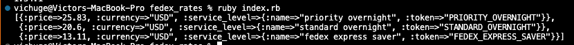

# Fedex rates
This repository is an example of using the fedex rates gem to calculate shipping rates for a package.

## 🔧 Built With these features
- Ruby 3.1.2
- Bundle 2.3.15
- Rubocop gem 1.34.1
- fedexvichuge gem 0.1.1

## 🛠 Getting Started
## Install

```git clone https://github.com/vichuge/fedex_rates.git``` on your terminal.

## Run the application
To get a local copy up and running follow these simple example steps.

- Open a terminal
- Copy this code on your terminal: ```git clone https://github.com/vichuge/fedex_rates.git```
- Then `cd fedex_rates` 
- Use `bundle install` to add the gems to your local environment
- Now, run the application with `ruby index.rb` and you'll have something like this:



- ⚠️ Remember, you need to have a valid fedex account to use this application. To create the variable just follow the credentials example below with valid keys:

```ruby
credentials = {
  key: "xxxxxxxxxxxxxxxx",
  password: "xxxxxxxxxxxxxxxxxxxxxxxxx",
  account_number: "xxxxxxxxx",
  meter_number: "xxxxxxxxx"
}
```

## ✒️ Author

👤 **Victor Pacheco**

- GitHub: [@vichuge](https://github.com/vichuge)
- LinkedIn: [LinkedIn](https://www.linkedin.com/in/victor-pacheco-7946aab2/)
- Twitter: [@Pachecofloresv](https://twitter.com/Pachecofloresv)

## 🤝 Contributing
Contributions, issues and feature requests are welcome!

Feel free to check the [issues page](https://github.com/vichuge/fedex_rates/issues).

## Show your support

Give a ⭐️ if you like this project!

## 📝 License

This project is [MIT](./LICENSE) licensed.